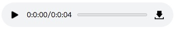

amr-player
play remote amr format audio with JavaScript  

copy by https://github.com/alex374/amr-player;
	
After that, I revised it to make it better.

## 2019.7.16：
	- 1.3.0
	- 1、修复第一次为播放结束第二次没播放结束会自动中断播放问题
	- 2、新增 按钮可操作播放器播放功能(必须amr文件) 并且可返回播放回调状态
	
## 2019.7.15：
	- 1.2.0
	- 1、修复播放结束,播放器还在计时的问题
	- 2、修复页面同时创建多个元素时,页面很卡的问题
	- 3、优化了如果当前播放文件地址和页面URL协议不一致,则自动替换文件的协议地址为页面URL协议地址(可修改'this.changeProtocol' = false 则不自动替换)
	
## 2018.7.26：
	- 1.1.0
	- if the url not include ".amr", then use "audio" element play
	
## 2018.7.16：
	- 1.0.0
	- can simply play amr file, can play multiple amr at the same time
	
### AmrPlayer usage:
	
   > <body>
	   <amr src="xx.amr" autoplay="autoplay"></amr>
	   
	   
	   
	   
   </body>
   
#### property:
	> src : amr url
	  autoplay : can autoplay
   
### show amr player: 

   
   
